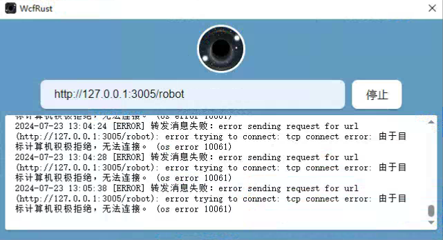

# 微信机器人

## 介绍

这是一个基于[wcf-client-rust](https://github.com/lich0821/wcf-client-rust)微信的机器人  
### 技术栈
nodejs+typescript+sequelize+pnpm
## 环境
windows系统  
nodejs > 18

1. 安装微信去这里下载 [3.9.10.27](https://github.com/lich0821/WeChatFerry/releases/tag/v39.2.4)
2. 安装[wcf-client-rust http客户端](https://github.com/lich0821/wcf-client-rust/releases/tag/v39.2.4.0)
3. 安装mysql5.7 数据库名robot_data 账号root 密码123456 可以在代码里面修改 src/server/models/sequelize.ts  

## 启动方法
1. 运行本项目pnpm run dev
2. 启动并登录一个微信小号
3. 打开wcf-client-rust http客户端，填写回调地址 http://127.0.0.1:3005/robot 点击启动  

4. 在要使用机器人的群 输入“开启群聊” 即可
5. http://127.0.0.1:10010/swagger 有机器人文档

## 目前实现的功能  
#### 这些都可以去代码里面看 有很多是自己私人定制的做个参考就行  
#### 关键词触发的事件都在src/server/events目录下 
#### src/server/job目录下是定时任务  
#### src/server/models 是数据库相关的
`1.打卡,2.天气,3.emo,4.骚话,5.土味情话,6.今日摸鱼,7.本周摸鱼,8.金币排行,9.崚影卡排行,10.我的信息,11.写真,12.小姐姐,13.吃啥,14.发起抽奖,15.加入抽奖,16.结束抽奖,17.内涵段子,18.摸鱼日报,19.男友视角,20.星座运势,21.黑丝视频,22.白丝视频,23.假期查询,24.下班时间,25.降雨量,26.天气,27.emo,28.骚话,29.土味情话`

## 有啥问题可以提 看到有空就回复，定制可以联系微信

